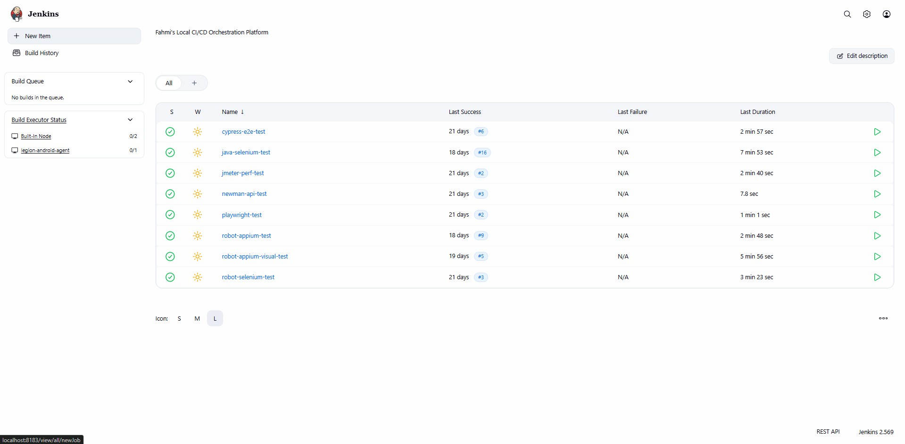
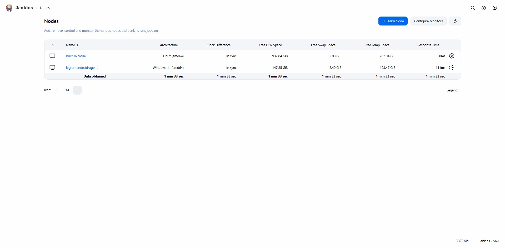

# Jenkins + Docker – Local CI/CD Orchestration Platform

A self-hosted CI/CD pipeline architecture built with **Jenkins** running
inside **Docker**, orchestrating test execution across **six independent
automation frameworks** spanning Node.js, Python, and Java ecosystems —
without relying on any cloud-hosted runner.

Alongside the containerized frameworks, the same Jenkins controller also
orchestrates **Android mobile automation** (Robot Framework + Appium) via
a **native Windows agent** running directly on the host — since emulators,
USB device access, and Appium/ADB tooling cannot run reliably inside a
Docker container. See [Hybrid Architecture](#hybrid-architecture-containers-native-agent)
below.

## Features

### Core Capabilities

- **Docker-outside-of-Docker (DooD)**: Jenkins container controls the host's Docker engine via mounted socket, spinning up ephemeral, per-stage containers for each framework
- **Multi-Framework Orchestration**: one Jenkins instance running six structurally distinct pipelines (Newman, Cypress, Playwright, Robot+Selenium, Java+Selenium, JMeter)
- **Native HTML Reporting**: Mochawesome, Playwright HTML, Robot Framework HTML, Allure, and JMeter Dashboard reports all served directly from Jenkins via HTML Publisher
- **JUnit Trend Reporting**: pass/fail history tracked natively in Jenkins for API-layer tests
- **Hybrid Agent Model**: a native Windows Jenkins agent runs alongside the containerized controller for Android emulator + Appium pipelines, which cannot run inside Docker

### Advanced Features

- **Cross-Language Container Strategy**: per-framework base image selection based on tooling availability
- **Stage-Level Failure Isolation**: `catchError` pattern lets failing test stages still produce full reports rather than aborting the pipeline
- **Automated Build Retention**: `buildDiscarder` keeps a rolling window of recent builds to manage local disk usage
- **Version-Pinned Execution**: explicit Docker image tags (no `:latest`) to avoid silent dependency drift across runs

## Platform Metrics

| Property | Value |
| --- | --- |
| Orchestrator | Jenkins (Declarative Pipeline, Groovy) |
| Container Runtime | Docker Desktop (Windows, WSL2 backend) |
| Native Agent | Windows agent (`legion-android-agent`), JNLP-connected |
| Frameworks Orchestrated | 6 containerized + 2 native mobile (functional, visual) |
| Language Ecosystems | Node.js, Python, Java/Maven |
| Report Formats | JUnit XML, Mochawesome HTML, Playwright HTML, Robot HTML, Allure HTML, JMeter Dashboard |


## Architecture

Jenkins itself runs as a container, not a native install. Since it has no
Docker CLI or daemon of its own, the host's Docker socket is mounted in,
allowing Jenkins to launch and discard framework-specific containers as
pipeline stages execute. Checkout, install, test execution, and report
generation each run in their own short-lived container, all coordinating
through one shared named Docker volume.


```
Host Machine (Docker Desktop)
│
├── fahmi-jenkins (container, always-on)
│     └── mounts: jenkins_home volume + /var/run/docker.sock
│
└── Docker Engine (host)
├── [ephemeral] postman/newman       ← Newman stage
├── [ephemeral] cypress/included     ← Cypress stage
├── [ephemeral] mcr.microsoft.com/playwright  ← Playwright stage
├── [ephemeral] selenium/standalone-chrome    ← Robot / Java stages
└── [ephemeral] eclipse-temurin      ← JMeter stage
```

## Hybrid Architecture: Containers + Native Agent

Android emulator acceleration, USB access to a real device, and the
Appium/ADB toolchain cannot run reliably inside a Docker container on
Windows — there's no clean path for nested virtualization or USB
passthrough into Docker Desktop. Rather than fight that constraint, the
mobile pipelines run on a **second Jenkins node**: a native Windows agent
process (`legion-android-agent`) installed directly on the same host,
connected back to the containerized controller over the existing JNLP
port.

```
Host Machine (Windows, Legion)
│
├── fahmi-jenkins (Docker container, controller)
│     └── mounts: jenkins_home volume + /var/run/docker.sock
│     └── runs: Newman, Cypress, Playwright, Robot+Selenium,
│                Java+Selenium, JMeter (all agent { label 'built-in' })
│
└── legion-android-agent (native Windows process / service)
      └── connects to controller via JNLP (port 8182)
      └── runs: Robot Framework + Appium (functional + visual)
      └── direct host access to:
            ├── Android SDK / emulator / adb
            ├── Node.js + Appium server + UiAutomator2 driver
            └── ImageMagick (RobotEyes visual diffing)
```

Because both node types register with the same controller, every
pipeline in this repo pins its `agent` label explicitly — `built-in` for
the six containerized frameworks, `legion-android-agent` for the two
mobile pipelines — so Jenkins never opportunistically schedules a job on
the wrong node type.

## Frameworks Orchestrated

| Framework | Language | Base Image | Report Format |
| --- | --- | --- | --- |
| Newman (Postman) | Node.js | `postman/newman` (official) | JUnit XML |
| Cypress | Node.js | `cypress/included` (official, bundled browser) | Mochawesome HTML |
| Playwright | Node.js | `mcr.microsoft.com/playwright` (version-pinned) | Native HTML |
| Robot Framework + Selenium | Python | `selenium/standalone-chrome` + pip install | Robot HTML |
| Java + Selenium + Allure | Java/Maven | `selenium/standalone-chrome` + manual JDK 19 | Allure HTML |
| JMeter | Java (CLI) | `eclipse-temurin:17-jdk` + manual binary | JMeter Dashboard |
| Robot Framework + Appium (Functional) | Python | native Windows agent, no container | Robot HTML |
| Robot Framework + Appium (Visual/RobotEyes) | Python | native Windows agent, no container | Visual Diff HTML |

???+ example "Jenkins Architecture"
    === "Dashboard Overview"
        <figure markdown="span">
        { width="1200" }
        <figcaption>Jenkins Dashboard</figcaption>
        </figure>
    === "Nodes Overview"
        <figure markdown="span">
        { width="1200" }
        <figcaption>Jenkins Nodes</figcaption>
        </figure>

## Pipeline Design Patterns

### Stage Separation Philosophy

Each pipeline follows a consistent stage order:

1. **Clean** — remove root-owned artifacts from the previous run before `git checkout` can be blocked by them
2. **Checkout** — pull latest from the framework's own GitHub repository
3. **Install** — `npm ci`, `pip install`, or `apt-get` + binary download depending on language ecosystem
4. **Test** — wrapped in `catchError(buildResult: 'UNSTABLE', stageResult: 'FAILURE')` so a failing test run does not abort the pipeline
5. **Report** — merge/generate HTML output and publish via `publishHTML`

For frameworks where tool state cannot persist across ephemeral containers
(e.g. Maven's `apt-get`-installed binary), Install and Test are deliberately
merged into a single container invocation.

### Failure-Tolerant Reporting

```groovy
catchError(buildResult: 'UNSTABLE', stageResult: 'FAILURE') {
    sh 'docker run ... run tests'
}
```

A build marked `UNSTABLE` (yellow) signals "tests ran but some failed,"
distinct from `FAILURE` (red) which means "the pipeline itself broke."
This mirrors `continue-on-error: true` in GitHub Actions and ensures
reports are always generated regardless of test outcome.

### Per-Framework Image Selection

Two recurring approaches, chosen per framework based on what each
official image bundles:

| Approach | Used For | Reasoning |
| --- | --- | --- |
| Start from tool-native image, bolt on language runtime | Cypress, Playwright, Robot+Selenium, Java+Selenium | Browser/ChromeDriver version matching is the harder problem; simpler to start where that's pre-solved |
| Start from language/runtime image, bolt on tool binary | Newman, JMeter | No browser dependency; lighter, more predictable base |


## Getting Started

### Prerequisites

- Docker Desktop (Windows/Mac/Linux)
- Jenkins container with Docker socket access configured

### Jenkins Container Setup

```bash
docker run -d --name fahmi-jenkins \
  -p 8183:8080 \
  -p 8182:50000 \
  -v jenkins_home:/var/jenkins_home \
  -v //var/run/docker.sock:/var/run/docker.sock \
  jenkins/jenkins:latest
```

### Post-Creation Steps

**Install Docker CLI inside Jenkins container:**

```bash
docker exec -u root -it fahmi-jenkins \
  bash -c "apt-get update && apt-get install -y docker.io"
```

**Fix socket permissions (required after every container restart):**

```bash
docker exec -u root -it fahmi-jenkins \
  bash -c "chmod 666 /var/run/docker.sock"
```

**Fix HTML report rendering (Jenkins CSP):**

Go to `localhost:8183/script` and run:

```groovy
System.setProperty("hudson.model.DirectoryBrowserSupport.CSP", "")
```

!!! warning
    Both the socket `chmod` and CSP override reset on container restart.
    Reapply them after each Docker Desktop restart.


## CI/CD Pipeline Structure

Each framework runs as an independent Jenkins Pipeline job pointing at
its own GitHub repository. No tooling is installed on the Jenkins host
itself — everything runs inside ephemeral containers.

### Stage Overview by Framework

| Framework | Stages |
| --- | --- |
| Newman | Checkout → Run Newman → Post (JUnit + Archive) |
| Cypress | Clean → Checkout → Install → Run Cypress → Merge & Generate Report → Post (HTML + Archive) |
| Playwright | Clean → Checkout → Install & Browsers → Run Playwright → Post (HTML + Archive) |
| Robot + Selenium | Clean → Checkout → Install & Run → Post (HTML + Archive) |
| Java + Selenium | Clean → Checkout → Install & Run → Generate Allure → Post (HTML + Archive) |
| JMeter | Clean → Checkout → Run JMeter → Generate HTML → Post (HTML + Archive) |
| Robot + Appium (Functional) | Checkout → Setup Python Env → Start Emulator → Start Appium Server → Run Robot Tests → Post (HTML + Archive) |
| Robot + Appium (Visual) | Checkout → Setup Python Env → Start Emulator → Start Appium Server → Debug PATH → Run Robot Tests → Post (HTML + Archive) |

### Jenkins File Sample

???+ example "Jenkins Pipeline Sample"
    === "Newman (Postman)"
        ```groovy
        pipeline {
            agent { label 'built-in' }
            stages {
                stage('Checkout') {
                    steps {
                        git branch: 'master', url: 'https://github.com/fahmi-wiradika/newman-automation.git'
                    }
                }
                stage('Run Newman') {
                    steps {
                        sh '''
                        COLLECTION=$(find postman -name "*NODE-E2E.postman_collection.json*" | head -1)
                        ENVIRONMENT=$(find postman -name "*prod-env.postman_environment.json*" | head -1)

                        mkdir -p newman-reports

                        docker run --rm \
                        -v 9a456fd0e8e983729cab1ac19b1d959fd3b349081fdf57be1a12ffe8615da89a:/var/jenkins_home \
                        -w /var/jenkins_home/workspace/newman-api-test \
                        postman/newman:latest \
                        run "$COLLECTION" --environment "$ENVIRONMENT" \
                        --reporters cli,junit \
                        --reporter-junit-export newman-reports/newman-report.xml
                        '''
                    }
                }
            }
            post {
                always {
                    junit 'newman-reports/newman-report.xml'
                    archiveArtifacts artifacts: 'newman-reports/*.xml', allowEmptyArchive: true
                }
            }
        }
        ```
    === "Apache JMeter"
        ```groovy
        pipeline {
            agent { label 'built-in' }

            options {
                buildDiscarder(logRotator(numToKeepStr: '10'))
            }

            stages {
                stage('Clean Previous Reports') {
                    steps {
                        sh '''
                        docker run --rm \
                        -v 9a456fd0e8e983729cab1ac19b1d959fd3b349081fdf57be1a12ffe8615da89a:/var/jenkins_home \
                        -w /var/jenkins_home/workspace/jmeter-perf-test \
                        -u root \
                        eclipse-temurin:17-jdk \
                        rm -rf reports
                        '''
                    }
                }
                
                stage('Checkout') {
                    steps {
                        git branch: 'master', url: 'https://github.com/fahmi-wiradika/performance-test.git'
                    }
                }
                
                stage('Run JMeter') {
                    steps {
                        catchError(buildResult: 'UNSTABLE', stageResult: 'FAILURE') {
                            sh '''
                            docker run --rm \
                            -v 9a456fd0e8e983729cab1ac19b1d959fd3b349081fdf57be1a12ffe8615da89a:/var/jenkins_home \
                            -w /var/jenkins_home/workspace/jmeter-perf-test \
                            eclipse-temurin:17-jdk \
                            sh -c "
                                mkdir -p reports &&
                                curl -L https://archive.apache.org/dist/jmeter/binaries/apache-jmeter-5.5.tgz -o jmeter.tgz &&
                                tar -xzf jmeter.tgz &&
                                ./apache-jmeter-5.5/bin/jmeter -n \
                                -t jmeter-test-plan/simple-crud.jmx \
                                -l reports/report.jtl \
                                -j reports/jmeter.log \
                                -Jusers=5 -Jiterations=5 -Jrampup=10
                            "
                            '''
                        }
                    }
                }

                stage('Generate HTML Report') {
                    steps {
                        sh '''
                        docker run --rm \
                        -v 9a456fd0e8e983729cab1ac19b1d959fd3b349081fdf57be1a12ffe8615da89a:/var/jenkins_home \
                        -w /var/jenkins_home/workspace/jmeter-perf-test \
                        eclipse-temurin:17-jdk \
                        sh -c "
                            curl -L https://archive.apache.org/dist/jmeter/binaries/apache-jmeter-5.5.tgz -o jmeter.tgz &&
                            tar -xzf jmeter.tgz &&
                            ./apache-jmeter-5.5/bin/jmeter -g reports/report.jtl -o reports/html
                        "
                        '''
                    }
                }
            }

            post {
                always {
                    publishHTML([
                        allowMissing: true,
                        alwaysLinkToLastBuild: true,
                        keepAll: true,
                        reportDir: 'reports/html',
                        reportFiles: 'index.html',
                        reportName: 'JMeter Performance Report'
                    ])
                    archiveArtifacts artifacts: 'reports/*.jtl, reports/*.log, reports/html/**', allowEmptyArchive: true
                }
            }
        }
        ```
    === "Cypress"
        ```groovy
        pipeline {
            agent { label 'built-in' }
            
            options {
                buildDiscarder(logRotator(numToKeepStr: '10'))
            }

            stages {
                stage('Checkout') {
                    steps {
                        git branch: 'Master', url: 'https://github.com/fahmi-wiradika/cypress-basic.git'
                    }
                }

                stage('Clean Previous Reports') {
                    steps {
                        sh '''
                        docker run --rm \
                        -v 9a456fd0e8e983729cab1ac19b1d959fd3b349081fdf57be1a12ffe8615da89a:/var/jenkins_home \
                        -w /var/jenkins_home/workspace/cypress-e2e-test \
                        -u root \
                        node:22 \
                        rm -rf cypress/reports
                        '''
                    }
                }

                stage('Install Dependencies') {
                    steps {
                        sh '''
                        docker run --rm \
                        -v 9a456fd0e8e983729cab1ac19b1d959fd3b349081fdf57be1a12ffe8615da89a:/var/jenkins_home \
                        -w /var/jenkins_home/workspace/cypress-e2e-test \
                        node:22 \
                        npm ci
                        '''
                    }
                }

                stage('Run Cypress') {
                    steps {
                        catchError(buildResult: 'UNSTABLE', stageResult: 'FAILURE') {
                            sh '''
                            docker run --rm \
                            --shm-size=1g \
                            -v 9a456fd0e8e983729cab1ac19b1d959fd3b349081fdf57be1a12ffe8615da89a:/var/jenkins_home \
                            -w /var/jenkins_home/workspace/cypress-e2e-test \
                            cypress/included:latest \
                            --spec "cypress/e2e/simple-crud/**/*.cy.js,!cypress/e2e/simple-crud/ui/multiple-crud-e2e-pom.cy.js,!cypress/e2e/simple-crud/ui/product-assertion.cy.js" \
                            --env version=production \
                            --reporter mochawesome \
                            --reporter-options "reportDir=cypress/reports/mocha,overwrite=false,html=false,json=true"
                            '''
                        }
                    }
                }

                stage('Merge & Generate Report') {
                    steps {
                        sh '''
                        docker run --rm \
                        -v 9a456fd0e8e983729cab1ac19b1d959fd3b349081fdf57be1a12ffe8615da89a:/var/jenkins_home \
                        -w /var/jenkins_home/workspace/cypress-e2e-test \
                        node:22 \
                        sh -c "npx mochawesome-merge cypress/reports/mocha/*.json > cypress/reports/merged.json && npx marge cypress/reports/merged.json --reportDir cypress/reports/html --inline"
                        '''
                    }
                }
            }

            post {
                always {
                    publishHTML([
                        allowMissing: true,
                        alwaysLinkToLastBuild: true,
                        keepAll: true,
                        reportDir: 'cypress/reports/html',
                        reportFiles: 'merged.html',
                        reportName: 'Cypress Mochawesome Report'
                    ])
                    archiveArtifacts artifacts: 'cypress/reports/html/**', allowEmptyArchive: true
                }
            }
        }
        ```
    === "Playwright"
        ```groovy
        pipeline {
            agent { label 'built-in' }

            options {
                buildDiscarder(logRotator(numToKeepStr: '10'))
            }

            stages {
                stage('Checkout') {
                    steps {
                        git branch: 'master', url: 'https://github.com/fahmi-wiradika/playwright-js.git'
                    }
                }

                stage('Clean Previous Reports') {
                    steps {
                        sh '''
                        docker run --rm \
                        -v 9a456fd0e8e983729cab1ac19b1d959fd3b349081fdf57be1a12ffe8615da89a:/var/jenkins_home \
                        -w /var/jenkins_home/workspace/playwright-test \
                        -u root \
                        node:22 \
                        rm -rf playwright-report test-results
                        '''
                    }
                }

                stage('Install Dependencies & Browsers') {
                    steps {
                        sh '''
                        docker run --rm \
                        -v 9a456fd0e8e983729cab1ac19b1d959fd3b349081fdf57be1a12ffe8615da89a:/var/jenkins_home \
                        -w /var/jenkins_home/workspace/playwright-test \
                        mcr.microsoft.com/playwright:v1.58.2-noble \
                        sh -c "npm install"
                        '''
                    }
                }
                
                stage('Run Playwright Tests') {
                    steps {
                        catchError(buildResult: 'UNSTABLE', stageResult: 'FAILURE') {
                            sh '''
                            docker run --rm \
                            --shm-size=1g \
                            -v 9a456fd0e8e983729cab1ac19b1d959fd3b349081fdf57be1a12ffe8615da89a:/var/jenkins_home \
                            -w /var/jenkins_home/workspace/playwright-test \
                            mcr.microsoft.com/playwright:v1.58.2-noble \
                            npx playwright test tests/ci
                            '''
                        }
                    }
                }
            }

            post {
                always {
                    publishHTML([
                        allowMissing: true,
                        alwaysLinkToLastBuild: true,
                        keepAll: true,
                        reportDir: 'playwright-report',
                        reportFiles: 'index.html',
                        reportName: 'Playwright HTML Report'
                    ])
                    archiveArtifacts artifacts: 'playwright-report/**, test-results/**', allowEmptyArchive: true
                }
            }
        }
        ```
    === "Robot Framework - Selenium"
        ```groovy
        pipeline {
            agent { label 'built-in' }

            options {
                buildDiscarder(logRotator(numToKeepStr: '10'))
            }

            stages {
                stage('Clean Workspace') {
                    steps {
                        sh '''
                        docker run --rm \
                        -v 9a456fd0e8e983729cab1ac19b1d959fd3b349081fdf57be1a12ffe8615da89a:/var/jenkins_home \
                        -w /var/jenkins_home/workspace/robot-selenium-test \
                        -u root \
                        python:3.12-slim \
                        rm -rf results
                        '''
                    }
                }

                stage('Checkout') {
                    steps {
                        git branch: 'main', url: 'https://github.com/fahmi-wiradika/robot-framework.git'
                    }
                }

                stage('Install Dependencies & Run Tests') {
                    steps {
                        catchError(buildResult: 'UNSTABLE', stageResult: 'FAILURE') {
                            sh '''
                            docker run --rm \
                            --shm-size=1g \
                            -u root \
                            -v 9a456fd0e8e983729cab1ac19b1d959fd3b349081fdf57be1a12ffe8615da89a:/var/jenkins_home \
                            -w /var/jenkins_home/workspace/robot-selenium-test \
                            selenium/standalone-chrome:latest \
                            bash -c "
                                apt-get update && apt-get install -y python3-pip &&
                                pip install -r requirements.txt &&
                                robot --outputdir results --loglevel INFO tests/
                            "
                            '''
                        }
                    }
                }
            }

            post {
                always {
                    publishHTML([
                        allowMissing: true,
                        alwaysLinkToLastBuild: true,
                        keepAll: true,
                        reportDir: 'results',
                        reportFiles: 'report.html',
                        reportName: 'Robot Framework Report'
                    ])
                    archiveArtifacts artifacts: 'results/**', allowEmptyArchive: true
                }
            }
        }
        ```
    === "Java - Selenium - Allure"
        ```groovy
        pipeline {
            agent { label 'built-in' }

            options {
                buildDiscarder(logRotator(numToKeepStr: '10'))
            }

            stages {
                stage('Clean Workspace') {
                    steps {
                        sh '''
                        docker run --rm \
                        -v 9a456fd0e8e983729cab1ac19b1d959fd3b349081fdf57be1a12ffe8615da89a:/var/jenkins_home \
                        -w /var/jenkins_home/workspace/java-selenium-test \
                        -u root \
                        selenium/standalone-chrome:latest \
                        rm -rf target jdk-19.0.2+7 jdk19.tar.gz
                        '''
                    }
                }

                stage('Checkout') {
                    steps {
                        git branch: 'main', url: 'https://github.com/fahmi-wiradika/java-automation.git'
                    }
                }

                stage('Install JDK 19 & Maven') {
                    steps {
                        sh '''
                        docker run --rm \
                        -u root \
                        -v 9a456fd0e8e983729cab1ac19b1d959fd3b349081fdf57be1a12ffe8615da89a:/var/jenkins_home \
                        -w /var/jenkins_home/workspace/java-selenium-test \
                        selenium/standalone-chrome:latest \
                        bash -c "
                            apt-get update && apt-get install -y maven curl &&
                            curl -L https://api.adoptium.net/v3/binary/version/jdk-19.0.2+7/linux/x64/jdk/hotspot/normal/adoptium -o jdk19.tar.gz &&
                            tar -xzf jdk19.tar.gz
                        "
                        '''
                    }
                }

                stage('Install Dependencies & Run Tests') {
                    steps {
                        catchError(buildResult: 'UNSTABLE', stageResult: 'FAILURE') {
                            sh '''
                            docker run --rm \
                            --shm-size=1g \
                            -u root \
                            -v 9a456fd0e8e983729cab1ac19b1d959fd3b349081fdf57be1a12ffe8615da89a:/var/jenkins_home \
                            -w /var/jenkins_home/workspace/java-selenium-test \
                            selenium/standalone-chrome:latest \
                            bash -c "
                                apt-get update && apt-get install -y maven curl &&
                                if [ ! -d jdk-19.0.2+7 ]; then
                                curl -L https://api.adoptium.net/v3/binary/version/jdk-19.0.2+7/linux/x64/jdk/hotspot/normal/adoptium -o jdk19.tar.gz &&
                                tar -xzf jdk19.tar.gz
                                fi &&
                                export JAVA_HOME=\\$(pwd)/jdk-19.0.2+7 &&
                                export PATH=\\$JAVA_HOME/bin:\\$PATH &&
                                mvn clean test -Dtest=**/ci/*Test
                            "
                            '''
                        }
                    }
                }

                stage('Generate Allure Report') {
                    steps {
                        sh '''
                        docker run --rm \
                        -u root \
                        -v 9a456fd0e8e983729cab1ac19b1d959fd3b349081fdf57be1a12ffe8615da89a:/var/jenkins_home \
                        -w /var/jenkins_home/workspace/java-selenium-test \
                        selenium/standalone-chrome:latest \
                        bash -c "
                            curl -o allure-2.30.0.tgz -Ls https://repo.maven.apache.org/maven2/io/qameta/allure/allure-commandline/2.30.0/allure-commandline-2.30.0.tgz &&
                            tar -zxf allure-2.30.0.tgz &&
                            if [ -d target/allure-results ] && [ \\\"\\$(ls -A target/allure-results)\\\" ]; then
                            ./allure-2.30.0/bin/allure generate target/allure-results --clean -o target/allure-report
                            else
                            mkdir -p target/allure-report
                            echo '<html><body><h1>No test results found</h1></body></html>' > target/allure-report/index.html
                            fi
                        "
                        '''
                    }
                }
            }

            post {
                always {
                    publishHTML([
                        allowMissing: true,
                        alwaysLinkToLastBuild: true,
                        keepAll: true,
                        reportDir: 'target/allure-report',
                        reportFiles: 'index.html',
                        reportName: 'Allure Test Report'
                    ])
                    archiveArtifacts artifacts: 'target/allure-report/**, target/surefire-reports/**', allowEmptyArchive: true
                }
            }
        }
        ```
    === "Robot Framework - Appium (Functional)"
        ```groovy
        pipeline {
            agent { label 'legion-android-agent' }

            options {
                disableConcurrentBuilds()
                timestamps()
            }

            environment {
                VENV = "${WORKSPACE}\\.venv"
            }

            stages {
                stage('Checkout') {
                    steps {
                        git branch: 'master',
                            url: 'https://github.com/fahmi-wiradika/robot-appium.git'
                    }
                }

                stage('Setup Python Env') {
                    steps {
                        bat '''
                        python -m venv .venv
                        call .venv\\Scripts\\activate.bat
                        pip install -r requirement.txt
                        '''
                    }
                }

                stage('Start Emulator') {
                    steps {
                        bat '''
                        start /B emulator -avd Pixel_9_Pro_XL_API_35 -no-snapshot-load -dns-server 8.8.8.8,8.8.4.4
                        adb wait-for-device
                        '''
                        powershell '''
                        $maxWait = 120
                        $elapsed = 0
                        do {
                            $boot = (adb shell getprop sys.boot_completed).Trim()
                            if ($boot -eq "1") { break }
                            Start-Sleep -Seconds 2
                            $elapsed += 2
                            if ($elapsed -ge $maxWait) {
                                Write-Error "Emulator boot timed out"
                                exit 1
                            }
                        } while ($true)
                        Write-Host "Emulator boot completed"
                        '''
                    }
                }

                stage('Start Appium Server') {
                    steps {
                        bat 'start /B appium --log appium.log'
                        powershell '''
                        $maxWait = 30
                        $elapsed = 0
                        do {
                            try {
                                $res = Invoke-WebRequest -Uri "http://127.0.0.1:4723/status" -UseBasicParsing -TimeoutSec 2
                                if ($res.StatusCode -eq 200) { break }
                            } catch {}
                            Start-Sleep -Seconds 2
                            $elapsed += 2
                            if ($elapsed -ge $maxWait) {
                                Write-Error "Appium server did not become ready"
                                exit 1
                            }
                        } while ($true)
                        Write-Host "Appium server is ready"
                        '''
                    }
                }

                stage('Run Robot Tests') {
                    steps {
                        catchError(buildResult: 'UNSTABLE', stageResult: 'FAILURE') {
                            bat '''
                            call .venv\\Scripts\\activate.bat
                            robot --outputdir results --loglevel INFO sauce-labs-mobile\\tests\\behavior\\sauce_login.robot
                            '''
                        }
                    }
                }
            }

            post {
                always {
                    bat '''
                    taskkill /IM node.exe /F /T || exit 0
                    adb emu kill || exit 0
                    '''
                    publishHTML([
                        allowMissing: false,
                        alwaysLinkToLastBuild: true,
                        keepAll: true,
                        reportDir: 'results',
                        reportFiles: 'report.html',
                        reportName: 'Robot Report'
                    ])
                    archiveArtifacts artifacts: 'results/**', allowEmptyArchive: true
                }
            }
        }
        ```
    === "Robot Framework - Appium (Visual/RobotEyes)"
        ```groovy
        pipeline {
            agent { label 'legion-android-agent' }

            options {
                disableConcurrentBuilds()
                timestamps()
            }

            environment {
                VENV = "${WORKSPACE}\\.venv"
                PATH = "C:\\Program Files\\ImageMagick-7.1.2-Q16;${env.PATH}"
            }

            stages {
                stage('Checkout') {
                    steps {
                        git branch: 'master',
                            url: 'https://github.com/fahmi-wiradika/robot-appium.git'
                    }
                }

                stage('Setup Python Env') {
                    steps {
                        bat '''
                        python -m venv .venv
                        call .venv\\Scripts\\activate.bat
                        pip install -r requirement.txt
                        '''
                    }
                }

                stage('Start Emulator') {
                    steps {
                        bat '''
                        start /B emulator -avd Pixel_9_Pro_XL_API_35 -no-snapshot-load -dns-server 8.8.8.8,8.8.4.4
                        adb wait-for-device
                        '''
                        powershell '''
                        $maxWait = 120
                        $elapsed = 0
                        do {
                            $boot = (adb shell getprop sys.boot_completed).Trim()
                            if ($boot -eq "1") { break }
                            Start-Sleep -Seconds 2
                            $elapsed += 2
                            if ($elapsed -ge $maxWait) {
                                Write-Error "Emulator boot timed out"
                                exit 1
                            }
                        } while ($true)
                        Write-Host "Emulator boot completed"
                        '''
                    }
                }

                stage('Start Appium Server') {
                    steps {
                        bat 'start /B appium --log appium.log'
                        powershell '''
                        $maxWait = 30
                        $elapsed = 0
                        do {
                            try {
                                $res = Invoke-WebRequest -Uri "http://127.0.0.1:4723/status" -UseBasicParsing -TimeoutSec 2
                                if ($res.StatusCode -eq 200) { break }
                            } catch {}
                            Start-Sleep -Seconds 2
                            $elapsed += 2
                            if ($elapsed -ge $maxWait) {
                                Write-Error "Appium server did not become ready"
                                exit 1
                            }
                        } while ($true)
                        Write-Host "Appium server is ready"
                        '''
                    }
                }

                stage('Debug PATH') {
                    steps {
                        bat 'where magick'
                    }
                }

                stage('Run Robot Tests') {
                    steps {
                        catchError(buildResult: 'UNSTABLE', stageResult: 'FAILURE') {
                            bat '''
                            call .venv\\Scripts\\activate.bat
                            robot -d results -v images_dir:visual_images/baseline sauce-labs-mobile\\tests\\component\\sauce_login_robot_eyes.robot
                            '''
                        }
                    }
                }
            }

            post {
                always {
                    bat '''
                    taskkill /IM node.exe /F /T || exit 0
                    adb emu kill || exit 0
                    '''
                    publishHTML([
                        allowMissing: false,
                        alwaysLinkToLastBuild: true,
                        keepAll: true,
                        reportDir: 'results',
                        reportFiles: 'visualReport.html',
                        reportName: 'Visual Test Report'
                    ])
                    archiveArtifacts artifacts: 'results/**', allowEmptyArchive: true
                }
            }
        }
        ```

## Mobile Pipeline Requirements (`legion-android-agent`)

Unlike the containerized frameworks above — which need nothing installed
on the host beyond Docker itself — the mobile pipelines run directly on
the native agent, so all tooling must be installed and on `PATH` for the
Windows account/service running that agent:

| Requirement | Used For | Notes |
| --- | --- | --- |
| Android SDK + `adb` | Emulator control, device communication | Must be on `PATH`; `ANDROID_HOME` set |
| Android Emulator + AVD | Test target | AVD name in the pipeline must match an existing image (e.g. `Pixel_9_Pro_XL_API_35`) |
| Node.js + Appium 2 + UiAutomator2 driver | Appium server + Android driver | `npm install -g appium && appium driver install uiautomator2` |
| Python 3.8+ | Test execution | Fresh `venv` created per build from `requirement.txt` |
| ImageMagick 7.x | Visual pipeline only — RobotEyes pixel diffing | Must be on `PATH`; if only in *User* PATH, a Windows service agent won't see it — add to *System* PATH or override `PATH` in the pipeline's `environment` block |
| Real device (optional) | Alternative to emulator | USB debugging enabled, authorized via `adb devices` |

!!! warning
    The visual pipeline's `PATH` override (`environment { PATH = "C:\\Program Files\\ImageMagick-7.1.2-Q16;${env.PATH}" }`)
    is a workaround for the native agent not inheriting the interactive
    user's PATH when running as a Windows service. Prefer adding
    ImageMagick to the **System** PATH and restarting the agent service
    if you want this to apply across all pipelines rather than just this
    one.

## Challenges Solved

### 1. Docker-outside-of-Docker Path Mismatch

**Symptom:** `ENOENT: no such file or directory` or test files not found
inside ephemeral containers, despite existing in the Jenkins workspace.

**Root Cause:** `$(pwd)` inside the Jenkins container resolves to a path
that only exists within that container's filesystem view. Passing it to
`docker run -v` asks the *host* Docker engine to mount that path from the
*host* filesystem — where it doesn't exist.

**Fix:** Mount the named volume itself into sibling containers using the
volume name, not a path:

```bash
-v jenkins_home_volume_name:/var/jenkins_home
```

**Why it matters:** This is the fundamental constraint of
Docker-outside-of-Docker. Any CI tooling built on this pattern must
account for it — paths are always relative to *whoever is asking*.


### 2. Cross-Container Permission Boundaries

**Symptom:** `Permission denied` on `git checkout`, `rm -rf`, or output
directory creation — despite the previous stage having successfully written
to the same location.

**Root Cause:** Ephemeral containers running as root write files owned by
`uid 0`. The next container, running as a non-root user (e.g. `seluser` in
Selenium images, `jenkins` in the Jenkins container), cannot delete or
overwrite those files.

**Fix:** Clean stages always run as `-u root`. The DooD architecture
means any container can be elevated this way without affecting the
Jenkins host itself.

**Why it matters:** Cross-container ownership is invisible until it
blocks you — and it always blocks at the worst moment (e.g. `git checkout`
failing on the first stage).


### 3. Version Pinning Across the Stack

**Symptom:** `Executable doesn't exist` (Playwright), `EBADENGINE`
warnings (Node), `source/target release X requires --release Y`
(Java/Maven compiler).

**Root Cause:** Each framework has at least two version numbers that must
match: the npm/pip/Maven package version and the Docker image tag.
Floating `:latest` tags paper over this until a new release breaks the
pairing.

**Fix:** Pin Docker image tags to match the dependency version exactly
(e.g. `mcr.microsoft.com/playwright:v1.58.2-noble` for
`@playwright/test@1.58.2`). For Java, verify the JDK version available
in the target image's package repos before assuming it matches
`pom.xml`'s `maven.compiler.source`.


## Troubleshooting

### Docker socket `permission denied` after Jenkins restart

The socket `chmod` does not persist across container restarts. Reapply:

```bash
docker exec -u root -it fahmi-jenkins bash -c "chmod 666 /var/run/docker.sock"
```

### HTML reports render blank or unstyled

Jenkins blocks inline scripts/styles in served HTML by default (Content
Security Policy). Reapply the CSP override via Script Console at
`localhost:8183/script`:

```groovy
System.setProperty("hudson.model.DirectoryBrowserSupport.CSP", "")
```

### `mvn: command not found` or `robot: command not found` mid-pipeline

Tool installed via `apt-get` in one stage's container is not available in
the next stage's fresh container. Merge Install and Run into a single
`docker run` invocation.

### `git checkout` fails with `Permission denied` on first stage

Root-owned files from a previous build are blocking Git. Move your
Clean stage *before* Checkout, not after.

### `'magick' is not recognized as an internal or external command` (visual pipeline)

The native agent process doesn't inherit the interactive user's PATH,
even though `magick --version` works fine in a manual PowerShell session.
Either override `PATH` directly in the pipeline's `environment` block, or
add ImageMagick's install directory to the **System** (not User)
environment variables and restart the `legion-android-agent` service.


## What's Next

- **Custom Dockerfiles** per framework to bake in dependencies and eliminate redundant `apt-get`/`npm install` on every run
- **Persistent socket/CSP fixes** via a custom Jenkins image with a startup entrypoint script
- **Selenium Grid** (multi-container pattern) for true parallel cross-browser execution
- **Real device execution** for the Appium pipelines (currently emulator-only; POCO X6 Pro real-device target planned)
- **Applitools Eyes pipeline variant** alongside the existing free/local RobotEyes visual pipeline, for cloud-based visual baselines


## Quick Links

- **Jenkins Documentation**: [https://www.jenkins.io/doc/](https://www.jenkins.io/doc/)
- **Docker Documentation**: [https://docs.docker.com](https://docs.docker.com)
- **Related Framework Pages**:
    - [Cypress](https://fahmi-wiradika.github.io/projects/professional/frameworks/cypress/)
    - [Playwright](https://fahmi-wiradika.github.io/projects/professional/frameworks/playwright/)
    - [Robot Framework Selenium](https://fahmi-wiradika.github.io/projects/professional/frameworks/robot-framework/)
    - [Java Automation](https://fahmi-wiradika.github.io/projects/professional/frameworks/java-automation/)